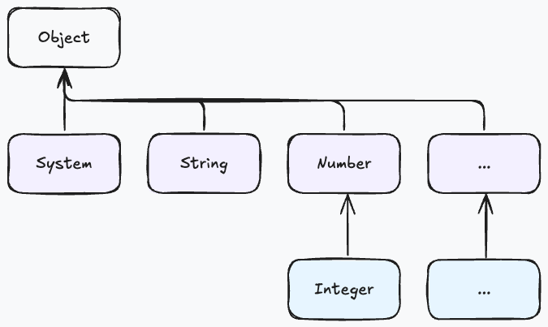
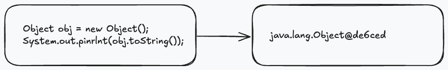
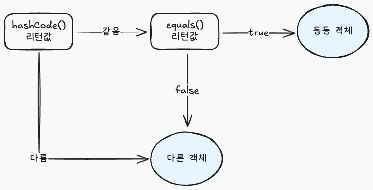

# 📘Object 클래스
📘 > 📝 > 🔷 > 📍

> 클래스를 선언 할때 extends 키워드로 다른 클래스를 상속하지 않으면 암시적으로 java.lang.Object 클래스를 상속 <br/>
> ∴ Java의 모든 클래스는 Object의 자식이거나 자손 클래스 이며 Object 메소드는 모든 객체에서 사용할 수 있다.



## 📝Object 메소드
🔷 boolean equals(Object obj)
* 객체의 번지를 비교하고 결과를 리턴
* ex01
🔷 int hashCode()
* 객체의 해시코드를 리턴
* 메모리 번지를 이용해서 해시코드를 생성하기 때문에 객체마다 다른 정수 값을 return
* 객체가 다르더라도 내부 데이터가 동일하다면 같은 정수값을 return
* ex02
🔷 String toString()
* 객체 문자 정보를 리턴
* "클래스명@16진수해시코드"로 구성된 문자열을 return
* 
* ex03
🔷 레코드 클래스 선언 (java21 에는 레)
* 데이터 전달을 위한 DTO(Data Transfer Object)를 작성할때 반복적으로 사용되는 코드를 줄이기 위해 도입(Java14 부터)
    * private final 필드가 자동 생성
    * 생성자 및 Getter 메소드가 자동으로 추가
    * hashCode(), equals(), toString() 메소드를 재정의 하여 자동 추가
* ex04
🔷 Lombok 사용하기
* JDK에 포함된 표준 라이브러리 X
* 개발자들이 즐겨 쓰는 자동 코드 생성 라이브러리
* 레코드 처럼 메소드 자동생성 하여 작성할 코드 양이 줄어든다.
    * Getter, Setter, hasCode(), equals(), toString()
    * 레코드와 차이점은 필드가 final이 아니며 getXXX, setXXX 으로 생성된다.
* ex05

| 어노테이션                    | 설명                                                                                           |
|--------------------------|----------------------------------------------------------------------------------------------|
| @NoArgsConstructor       | 기본(매개변수가 없는) 생성자 포함                                                                          |
| @AllArgsConstructor      | 모든 필드를 초기화 시키는 생성자 포함                                                                        |
| @RequiredArgsConstructor | 기본적으로 매개변수가 없는 생성자 포함. <br/>만약 final 또는 @NonNull이 붙은 필드가 있다면 이 필드만 초기화 시키는 생성자 포함 <br/> ex05 |
| @Getter                  | Getter 메소드 포함                                                                                |
| @Setter                  | Setter 메소드 포함                                                                                |
| @EqualsAndHashCode       | equals()와 hashCode() 메소드 포함                                                                  |
| @ToString                | toString() 메소드 포함                                                                            |

> Tips.<br/>
> 자바는 두 객체가 동등함을 비교할 때 hashCode()와 equals() 메소드를 같이 사용하는 경우가 많다. <br/>
> 1. hashCode()가 리턴하는 정수값이 같은지를 확인하고, <br/>
> 2. equals() 메소드가 true를 리턴하는지를 확인해서 동등 객체임을 판단한다.<br/>
     > 

> Tips. <br/>
> @RequiredArgsConstructor 에서 @NonNull이 붙은 경우 이 필드만 초기화 시키는 생성자를 포함한다.
>```java
>import lombok.Data;
>import lombok.NonNull;
>
>@Data
>public class Member {
>    private final String id;
>    @NonNull private String name;
>    private int age;
>}
>```
> Member(String, @NonNull String) 생성자 추가 <br/>
> final과 @NonNull의 차이점은 초기화된 final 필드는 변경 할수 없지만(Setter 생성 X)<br/>
> @NonNull은 null이 아닌 다른 값으로 Setter를 통해 변경 가능하다

