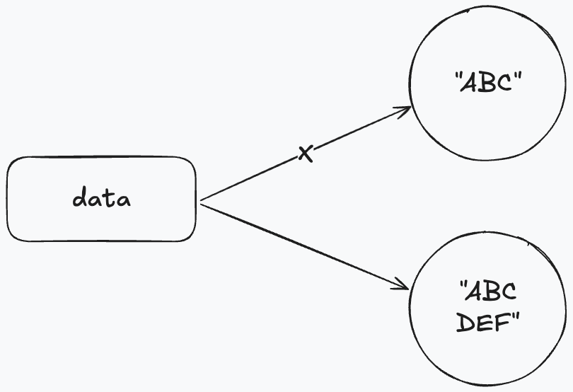

# 📘 문자열 클래스
📘 > 📝 > 🔷 > 📍

## 📝 주요 클래스
| 클래스             | 설명                       |
|-----------------|--------------------------|
| String          | 문자열을 저장하고 조작할 때 사용       |
| StringBuilder   | 효율적인 문자열 조작 기능이 필요할 때 사용 |
| StringTokenizer | 구분자로 연결된 문자열을 분리할 때 사용   |

### 🔷 String 클래스
> 문자열을 저장하고 조작 할떄 사용한다. <br/>
> 문자열은 자동으로 String 객체로 생성되지만 String 클래스의 다양한 생성자로 직접 객체를 생성도 가능하다.

```java
    String str = new String(byte[] bytes);
    String str = new String(byte[] bytes, String charsetName);
```
### 🔷 StringBuilder 클래스
> String은 내부 문자열을 수정할 수 없다.<br/>
> 다음 코드를 보면다른 문자열을 결합해서 내부 문자열을 변경 하는것처럼 보이지만<br/> 
> 새로운 String객체를 생성하는 것이다.
> ```java
>     String data = "ABC";
>     data += "DEF";
> ```
> 
> 문자열의 + 연산은 새로운 String 객체가 생성되고 이전 객체는 계속 버려지기 때문에 효율성이 좋다고는 볼수 없다.<br/>
> 그래서 StringBuilder를 사용해야 한다.
> [StringBuilder 참고](https://siyoon210.tistory.com/160)


### 🔷 StringTokenizer 클래스

> 문자열이 구분자(delimiter)로 연결되어 있을 경우, 구분자를 기준으로 문자열을 분리 하려면 <br/> 
> 방법1. String의 split() 메소드를 사용 <br/>
> 방법2. java.util 패키지의 StringTokenizer클래스를 사용

#### 📍String.split(), StringTokenizer 차이점

* String.split()
  * &, 쉼표(,), 하이픈(-)으로 구분된 사람 이름을 뽑아낼 경우 정규표현식으로 분리 할경우
  * ex) "홍길동&이수홍,박연수,김자바-최명호"
* StringTokenizer
  * 한종류의 구분자만 있을 경우