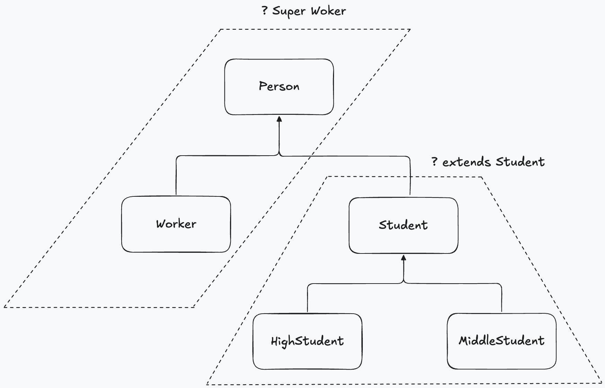

# 📘 제네릭
📘 > 📝 > 🔷 > 📍

## 📝 제네릭이란?

다음과 같이 Box Class를 선언하려고한다.<br/>
Box에 넣을 내용물로 content 필드를 선언하려고 할 때, 타입을 무엇으로 해야할까?

```java
public class Box{
    public ? content;
}
```

Box는 다양한 내용물을 저장해야 하므로 특정 클래스 타입으로 선언할 수 없다.<br/>
그래서 다음과 같이 Object 타입으로 선언한다.
```java
public class Box{
    public Object content;
}
```

Object 타입은 모든 클래스의 최상위 부모 클래스 이다.<br/>
그렇기 때문에 모든 객체는 부모 타입인 Object로 자동 타입 변환이 되므로 content 필드에는 어떤 객체든 대입이 가능하다.
```java
Box box = new Box();
box.content = 모든 객체;
```
문제는 Box 안의 내용물을 얻을 때이다.<br/>
content는 Object 타입이므로 어떤 객체가 대입되어 있는지 확실하지 않다.<br/>
이때 대입된 내용물의 타입을 안다면 강제 타입 변환을 거쳐 얻을수 잇따.<br/>
예를 들어 내용물이 String 타입이라면(String)으로 강제 타입 변환해서 내용물을 얻는 식이다.

```java
String content = (String) box.content;
```
그러나 어떤 내용물이 저장되어 있는지 모른다면 instanceof연산자로 타입을 조사할수는 있지만
모든 종류 클래스 대상으로 조사할수 없다.
<br/>
Box를 생성하기 전에 우리는 어떤 내용물을 넣을지 이미 알고있다.<br/>
따라서 Box를 생성할 때 저장 할 내용물의 타입을 미리 알려주면 Box는 content에 무엇이 대입되고, 읽을 때 어떤 타입으로 제공할지를 알게 된다.<br/>
이것이 제네릭이다.<br/>

> 제네릭(Generic)이란 결정되지 않은 타입을 파라미터로 처리하고<br/>
> 실제 사용할 때 파라미터를 구체적인 타입으로 대체시키는 기능

다음은 Box클래스에서 결정되지 않은 content의 타입을 T라는 타입 파라미터로 정의한 것이다.<br/>

[선언 예시(ex01)](./ex01/Main.java)<br/>
[메소드 예시(ex03)](./ex02/Main.java)<br/>
[다중 제너릭 설정 예시(ex04)](./ex03/Main.java)<br/>
[인터페이스 예시(ex05)](./ex04/Main.java)

### 🔷 Tips
사실 T에서 타입 파라미터로 쓰인는 T는 단지 이름일 뿐이기 때문에 T 대신 A부터 Z까지 어떤 알파벳을 사용해도 좋다.<br/>
단. 주의 할점은 타입 파라미터를 대체하는 타입은 클래스 및 인터페이스라는 것이다. 

## 📝 제네릭 타입
> 결정되지 않은 타입을 파라미터로 가지는 클래스와 인터페이스를 말한다.<br/>
> 제네릭 타입은 선언부에 '<>' 부호가 붙고 그사이에 타입 파라미터들이 위치한다.

```java
    public class 클래스명<A, B, ...> { ... }
    public interface 인터페이스명<A, b, ...> { ... }
```

* 타입 파라미터는 변수명과 동일한 규칙에 따라 작성할수있지만 일반적으로 대문자 알파벳 한 글자로 표현
* 외부에서 제네릭 타입을 사용하려면 타입 파라미터에 구체적인 타입을 지정해야한다.
  * 만약 지정하지 않으면 Object타입이 암묵적으로 사용된다.


## [📝 제네릭 메소드](./ex06/GenericExample.java)
> 타입 파라미터를 가지고 있는 메소드를 말한다.<br/>
> 타입 파라미터가 메소드 선언부에 정의 된다는 점에서 제네릭 타입과 차이가 있다.
> 제네릭 메소드는 리턴 타입 앞에 <>기호를 추가하고 타입 파라미터를 정의한 뒤, 리턴 타입과 매개 변수 타입에서 사용한다.

```java
    public <A, B,...> 리턴타입 메소드명(매개변수...) {...}
```

## [📝 제한된 타입 파라미터](./ex07/GenericExample.java)
> 경우에 따라 타입 파라미터를 대체하는 구체적인 타입을 제한할 필요가 있다.
> * ex) 숫자를 연산하는 제네릭 메소드는 대체 타입으로 Number 또는 자식 클래스(Byte, Short, Integer, Long, Double)로 제한할 필요가 있다.
> 특정 타입과 자식 또는 구현 관계에 있는 타입만 대체 할 수 있는 타입 파라미터를 제한된 타입 파라미터라고 한다.

```java
    // 인터페이스도 사용가능
    public <T extends 상위타입> 리턴타입 메소드(매개변수, ...) {...}
```
## [📝 와일드카드 타입 파라미터](./ex08/GenericExample.java)

> 제네릭 타입을 매개값이나 리턴 타입으로 사용할 때 타입 파라미터로 ?(와일드 카드)를 사용할수있다.<br/>
> ?는 범위에 있는 모든 타입으로 대체 할수있다는 표시이다.



타입 파라미터의 대체 타입으로 Student와 자식 클래스인 HighStudent와 MiddleStudent만 가능 하도록 매개 변수를 다음과 같이 선언 할수있다.

```java
// HighStudent, MiddleStudent 선언가능
리턴타입 메소드명(제네릭타입 <? extends Student> 변수) {..}
// Worker, Person
리턴타입 메소드명(제네릭타입<? extends Worker> 변수) {...}
// 어떤 타입이든 가능
리턴타입 메소드명(제네릭타입<?> 변수){...}
```

